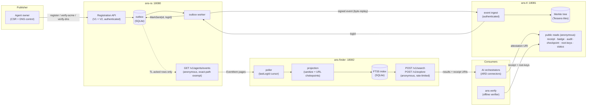
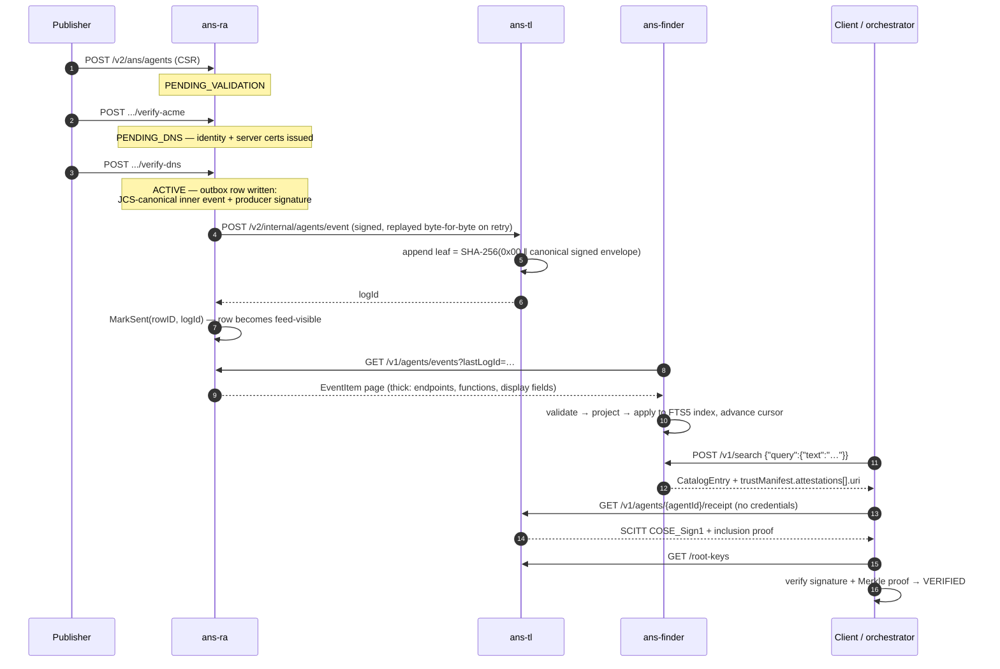
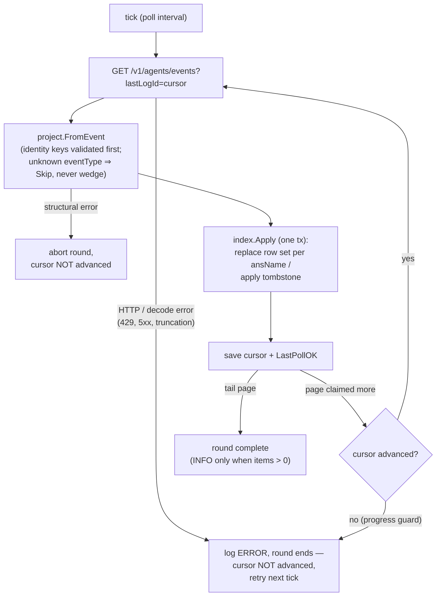
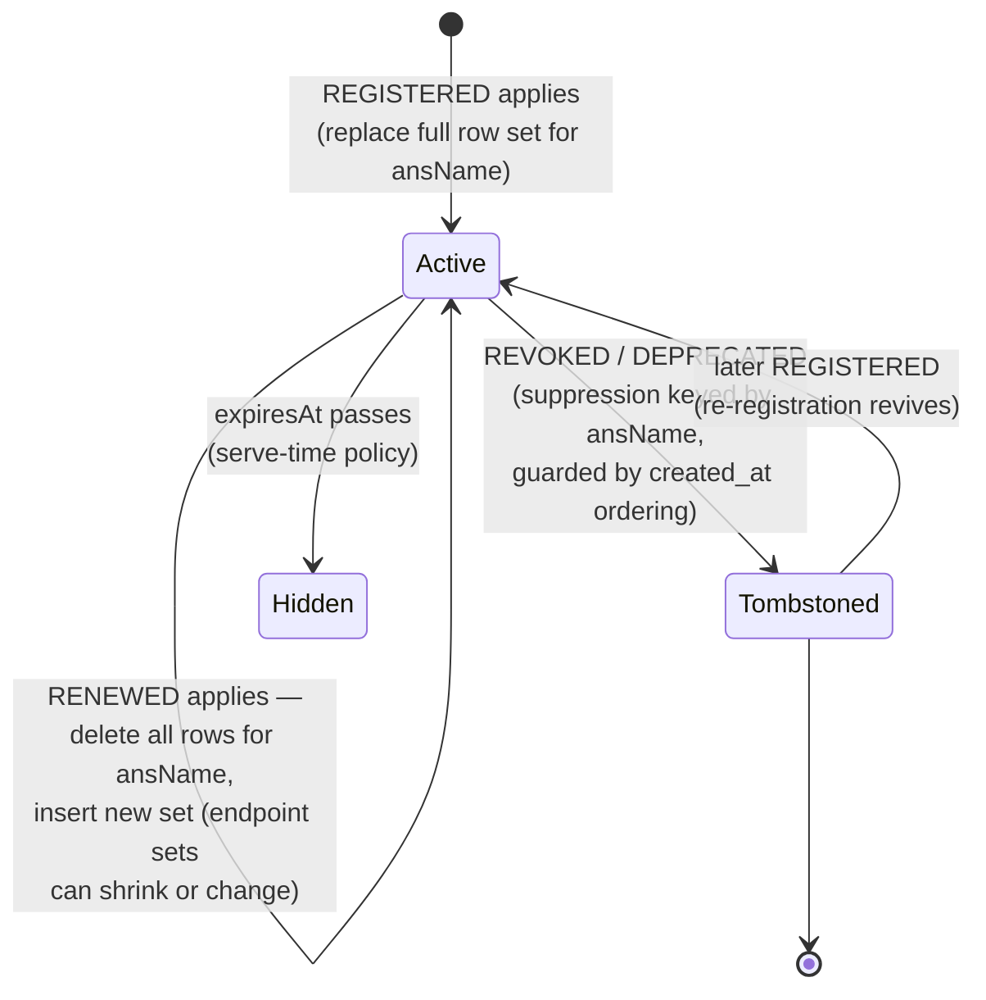
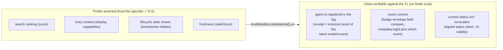

# ans-finder — as-built architecture

How the ARD-conformant discovery service works, end to end, as shipped.
The companion document [FINDER-ard-discovery-service.md](../pr-specs/FINDER-ard-discovery-service.md)
records the design rationale, contracts, and deliberate deviations; this
one describes the running system: what the pieces are, how an agent
travels from registration to a search result, and why every search
result is independently provable against the transparency log.

Audience: contributors and operators. Everything here is implemented
and exercised by `scripts/demo/run-lifecycle.sh` (16 steps, exit 0).

## 1. The one-paragraph version

A publisher registers an agent with the Registration Authority. The RA
proves control (ACME + DNS), issues certificates, and seals a signed
lifecycle event into the append-only Merkle-tree Transparency Log. The
RA then republishes that **sealed** event on a public events feed.
`ans-finder` polls the feed, projects each event into ARD catalog
entries through strict hygiene chokepoints, indexes them in SQLite
FTS5, and serves `POST /v1/search` / `POST /v1/explore`. Every entry
carries a `trustManifest` attestation URI pointing at the agent's SCITT
receipt on the TL — so a client that found an agent through search can
verify, offline, that the agent's registration is in the log, without
trusting the finder at all.

## 2. System topology



Three daemons, one verifier binary, and a strict one-way data flow.
The finder never talks to the TL; it hands its *clients* the TL URLs
they need to check its work.

## 3. Lifecycle of one agent, register → discover → prove



Step 7 is the load-bearing gate: a row reaches the feed **only after**
the TL has acknowledged the event with a `logId`
(`sent_at_ms IS NOT NULL AND log_id IS NOT NULL`). The invariant a
consumer can rely on: *in the feed ⇒ sealed in the log ⇒ receipt
resolvable*.

## 4. The events feed (RA side)

`GET /v1/agents/events` is the OSS implementation of the production
contract (`EventPageResponse{items[], lastLogId}`), byte-compatible by
conformance test with the consumer mirror in `internal/finder/feed`.

- **Anonymous by exact-path exemption.** The route is exempted with
  `WithAnonymousExactPath` — byte-exact, so the wildcard siblings under
  `/v1/agents/{agentId}/…` keep their authentication. (Subtree
  exemptions used elsewhere normalize trailing slashes; the TL
  registers `/v1/agents/` *with* a slash and the matcher tolerates
  both forms.)
- **TL-acked rows only**, ordered by outbox id, limit 1–200 (default
  100), `lastLogId` cursor; an unknown or aged-out cursor restarts from
  the oldest retained row. Retention defaults to 720h and is a read
  filter (`events-feed.retention`).
- **Indexed for anonymous traffic**: a partial (deliberately
  non-unique) index on `log_id` serves cursor resolution — uniqueness
  would wedge `MarkSent` retries under TL content-hash dedup — and a
  `(created_at_ms, id)` partial index makes the retention floor
  seekable; `ANALYZE` runs after migrations so the planner actually
  uses them (pinned by a query-plan regression test).
- **`providerId` is never emitted.** The underlying column is the
  authenticated owner identity; publishing it on an anonymous route
  would be an identity leak. The SELECT does not fetch it.
- **Token map at the wire**: domain `HTTP_API`/`STREAMABLE_HTTP`/
  `JSON_RPC` become `HTTP-API`/`STREAMABLE-HTTP`/`JSON-RPC`; domain
  `metadataUrl` becomes `metaDataUrl`. Unknown tokens pass through so a
  producer enum can grow without dropping data.
- **Sanitized failures**: non-domain 500s return a generic Problem
  detail; the real cause is logged server-side through a shared
  responder seam every RA handler embeds (it cannot emit a sanitized
  500 without logging the cause).

## 5. Inside ans-finder

### 5.1 Poller

One goroutine, one ticker. Each round drains pages until the feed omits
`lastLogId` (the tail), persisting the cursor after every applied page.



Failure philosophy: **transient errors retry on the next tick and never
move the cursor; a structurally invalid event stops ingestion at that
cursor on purpose** (a producer contract violation should be seen and
fixed, not skipped silently). Five consecutive failures at the same
cursor — of *any* kind, persistent transient failures included — emit a
distinct, greppable escalation line. The recovery runbook lives in the
`cmd/ans-finder` package comment (fix upstream, skip via the
`finder_cursor` row, or delete the index DB and rebuild from the feed —
bounded by feed retention).

The HTTP client enforces the transport policy: https unless the dev
`allow-http` override is set, TLS verification never skipped, redirects
refused, responses capped at 16 MiB with an explicit over-cap error.

### 5.2 Projection (pure, chokepointed)

`project.FromEvent` is the only path from feed bytes to index rows.

- **Lifecycle split.** `AGENT_REGISTERED`/`AGENT_RENEWED` take the
  Active path; `AGENT_REVOKED`/`AGENT_DEPRECATED` mint **tombstones
  from required identity fields only** (`agentId`, `ansName`, `logId`,
  `createdAt`). A revocation with no display name still tombstones —
  publisher-controlled optional fields can never block a revocation.
- **Text hygiene.** Every emitted string passes one sanitizer that
  strips control (Cc) and format (Cf) runes — bidi overrides,
  zero-width characters, the lot. Search results feed AI orchestrators;
  nothing steerable survives projection.
- **URL policy.** Every emitted URL — including the constructed
  `/.well-known/` fallbacks — passes `validateEmittedURL`: absolute,
  https (dev override aside), no userinfo/query/fragment, and the
  hostname must equal the attested `agentHost` (port-stripped,
  case-insensitive). Fail-closed: a policy-failing `metaDataUrl` skips
  the endpoint rather than falling back.
- **Identity.** `feed.ValidateIdentityKeys` — invoked by
  `project.FromEvent` before the lifecycle switch — binds `agentHost`
  to `ansName` via `domain.ParseAnsName` before anything else runs;
  the full contract `Validate` runs on the Active path. The ARD
  identifier is a lineage handle: `urn:air:{agentHost}:agents:{label}`
  — version successions share it by design; per-registration
  uniqueness rides the wrapper keys.
- **Fan-out.** One entry per includable endpoint: `A2A →
  application/a2a-agent-card+json`, `MCP → application/mcp-server-card+json`;
  `HTTP-API` endpoints produce no entry. Capabilities come from
  `functions[].name` (sanitized, deduped, sorted, capped at 50), tags
  from the union of `functions[].tags` (capped at 10).

### 5.3 Index

SQLite FTS5 (`unicode61`), one row per `(ans_name, type, url)`,
WAL, single connection (writes and reads serialize; documented
honestly in the adapter).



Two correctness rules earned the hard way in review:

1. **Replace-by-registration, not upsert-by-key.** An Active event's
   projection is the *complete* row set for its `ansName` at that log
   position. Apply deletes every row for the name, then inserts the new
   batch (duplicate `(type,url)` within one event — legal when two
   same-protocol endpoints share the well-known fallback — is deduped
   last-write-wins). Without this, a renamed artifact URL would leave
   the stale row discoverable forever.
2. **Ordering guards both directions.** A tombstone only suppresses
   rows with `created_at <=` its own (a stale replayed revoke cannot
   bury a newer registration), and an Active apply skips when a newer
   tombstone exists (a cursor-reset replay cannot transiently
   un-revoke). A tombstone that suppresses zero rows while Active rows
   exist logs a WARN — silence is not an acceptable failure mode for
   revocation.

Search scores map bm25 onto 0–100 — **relevance, never trust** (ARD
§3.4). Facets (`/v1/explore`) are real `GROUP BY` aggregations over
allowlisted fields only.

### 5.4 Search API hardening

The handlers are anonymous and internet-shaped, so cost is bounded
before work starts: 1 MiB body cap, query text ≤ 4 KiB / 64 tokens,
≤ 100 filter values, ≤ 5 distinct facets (duplicates rejected) —
over-limit is a 400 Problem, not a 500. Query text is quoted into FTS5 string literals
(operators, column filters, and quote-breakouts are inert — verified
adversarially), control/format runes are rejected up front, and a
global token bucket returns 429 with `Retry-After`. Errors are RFC 7807
`application/problem+json` with ARD codes; internal details never
reach the body. `pageToken` is opaque and query-bound: a forged or
cross-query token is rejected with 400 `INVALID_ARGUMENT`; a stale
token for the same query yields an empty page, never a panic.

Responses carry `staleSince` (additive spec amendment) once the poll
gap exceeds the configured bound — the feed being down degrades to
"serving last-known index, visibly stale," never to silent staleness.
`/v1/admin/ready` returns 503 until one poll round has ever completed
(persisted, so a warm restart with a populated index is immediately
ready); `/v1/admin/health` is pure liveness.

## 6. Trust model — what is asserted vs. what is provable



The finder ingests an **unsigned** feed over TLS; split-view and
omission by the RA are accepted residual risks, *detectable by clients*
because every entry links to the log. Revocation latency equals feed
latency — a client that needs certainty checks the status token, not
the search result. `metadata.logId` lets a client detect an entry built
from an older event than the receipt proves.

## 7. Configuration and operations

| Concern | Value |
|---|---|
| Ports | RA `:18080`, TL `:18081`, finder `:18082` (all overridable) |
| Finder env prefix | `ANS_FINDER_`, `__` maps to a config dot (`ANS_FINDER_SERVER__PORT`); hyphenated keys (`feed.base-url`, `poll-interval`, …) are file-only |
| Finder config | `config/finder-local.yaml`: feed base-url + poll-interval + page-size, stale-bound, `tl.public-base-url` (builds the receipt attestation URIs; empty omits attestations — set in every shipped config), rate limits, store path |
| Index durability | Fully derived state: delete the DB and restart to rebuild from the feed (bounded by feed retention) |
| Logs | zerolog; ingesting rounds at INFO with items/pages/lastLogId, idle rounds DEBUG, contract surprises WARN, wedge escalation has a distinct greppable line |
| Docs UI | each daemon serves its OpenAPI at `/docs` (`spec/api-spec-finder-v1.yaml`, docs-sync byte-parity enforced) |

### Demo (the 16-step proof)

```bash
make build                       # five binaries into bin/
scripts/demo/start.sh            # RA + TL + finder, readiness-gated
scripts/demo/run-lifecycle.sh    # register → … → VERIFIED → discovered
scripts/demo/stop.sh
```

Steps 14 and 15 are the contract: `ans-verify` prints `VERIFIED`
(credential-less receipt + status token), and `POST /v1/search` returns
the registered agent with the receipt URI that step 14 just proved. If
`:18080/:18081` are taken, relocate everything with
`RA_URL`/`TL_URL`/`FINDER_URL` + `ANS_RA_SERVER__PORT`/
`ANS_TL_SERVER__PORT`/`ANS_FINDER_SERVER__PORT` (env overrides the
config file).

## 8. Code map

| Layer | Package | Role |
|---|---|---|
| Feed contract | `internal/finder/feed` | Consumer-side `EventItem` types, field-for-field with the production swagger; `Validate`/`ValidateIdentityKeys` |
| Projection | `internal/finder/project` | `FromEvent` — lifecycle split, sanitize + URL chokepoints, URN minting, golden vectors |
| Index port | `internal/finder/index` | `Catalog` interface, query vocabulary, `ApplyReport` |
| Index adapter | `internal/adapter/store/sqlitefinder` | FTS5 schema, replace-by-registration apply, search/explore/filter SQL, cursor |
| Poller | `internal/finder/poller` | Round loop, cursor semantics, transport policy, wedge escalation |
| HTTP | `internal/finder/handler` | search/explore handlers, validation caps, rate limit, Problem errors, spec-conformance test |
| RA feed | `internal/ra/service` + `internal/ra/handler` + `internal/adapter/store/sqlite` | `EventsService`, `v1events` handler, `FeedStore`, token map, conformance tests |
| Entry point | `cmd/ans-finder` | config, wiring, graceful shutdown, health/ready, runbook doc |
